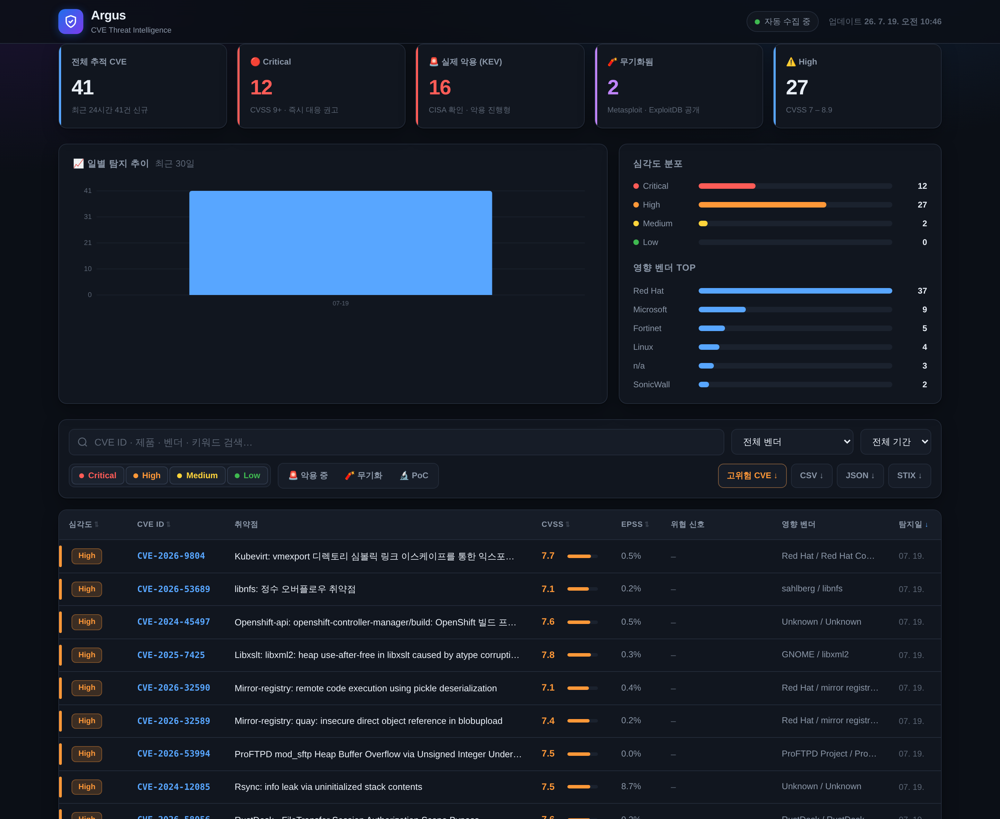
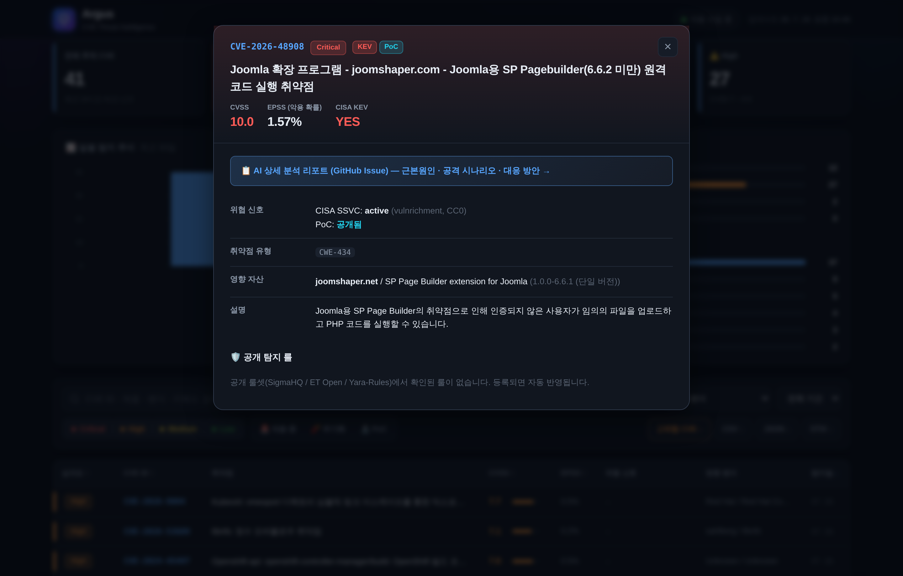

<div align="center">

# Argus · AI CVE Threat Intelligence

**신규 CVE를 자동 수집·AI 분석·위험도 분류해, 소규모 보안팀이 빠르게 대응하도록 돕는 위협 인텔리전스 파이프라인**

[](https://www.python.org/)
[](.github/workflows/argus.yml)
[](https://leekiyoon-sec.github.io/Argus-AI-Threat-Intelligence/cve.html)
[](LICENSE)
[](#비용)

**[🔗 라이브 대시보드 열기](https://leekiyoon-sec.github.io/Argus-AI-Threat-Intelligence/cve.html)**

</div>

<div align="center">



</div>

---

## 개요

Argus는 전 세계에서 매일 쏟아지는 CVE 중 **"우리가 지금 대응해야 할 것"** 만 골라내는 데 초점을 둡니다.
공개 취약점 데이터(CVE·KEV·EPSS·CISA SSVC 등)를 자동 수집하고, AI가 근본 원인·공격 시나리오·대응
방안을 한국어로 분석해 **GitHub Issue 리포트 · Slack 알림 · 웹 대시보드** 로 전달합니다.

별도 서버 없이 **GitHub Actions로 정기 실행**되며, 인프라 비용은 **전액 무료 티어** 안에서 운영됩니다.

> ⚠️ 본 도구가 생성·표시하는 분석 결과와 위험도 분류는 **참고용**입니다.
> 실제 대응·패치 결정은 각 조직의 환경과 공식 벤더 권고를 함께 검토해 판단하시기 바랍니다.

---

## 핵심 기능

| | 기능 | 설명 |
|:--:|---|---|
| 📦 | **SBOM 기반 자산 식별** | `syft`/`sbom-tool`로 만든 SBOM(CycloneDX·SPDX)을 `assets.json`으로 변환 — **"무엇을 지킬지"부터 명확히** 정의 |
| 🎯 | **자산 기준 위험도 티어링** | 등록 자산은 저위험까지 추적, 미등록(전체 감시)은 **고위험만** 수신해 알림 노이즈 차단 |
| 🧠 | **AI 심층 분석** | 근본 원인 · MITRE ATT&CK 공격 시나리오 · 공격 벡터 해석 · 대응 방안을 한국어로 생성 |
| 🚨 | **실제 악용 신호 우선** | CISA KEV · EPSS · Metasploit · ExploitDB · CISA SSVC를 종합해 "무기화·악용 진행형"을 최상위 노출 |
| 🔎 | **공개 탐지 룰 매칭** | SigmaHQ · ET Open · Yara-Rules에서 해당 CVE의 **공식 검증 룰**을 찾아 리포트에 첨부(출처·라이선스 보존) |
| 📈 | **에스컬레이션 재알림** | 저위험이던 CVE가 KEV 등재·EPSS 급등으로 고위험 전환되면 자동 재알림 |
| 🔁 | **무누락 수집** | 워터마크 기반 이어받기 + 소프트 데드라인으로 실행이 중단돼도 다음 회차가 빈틈 없이 재수집 |
| 📊 | **웹 대시보드 & Export** | 위협 중심 다크 대시보드 + CSV · JSON · **STIX 2.1** 내보내기 |

<div align="center">



</div>

---

## 아키텍처

```
  ⓪ 자산 식별 (SBOM)                ┌──────────── GitHub Actions (정기 실행, 무료) ────────────┐
  ─────────────────                 │                                                          │
  syft / sbom-tool   ── assets ──►  │  ①수집         ②위험도 분류      ③AI 분석      ④전달      │
  → SBOM → assets.json              │  CVE·KEV·EPSS   자산 매칭·티어링  Groq/Gemini  Issue·Slack │
  ("무엇을 지킬지")                 │  SSVC·PoC 신호  Critical/High/Low 한국어 분석  대시보드    │
                                    │       │                                        │         │
                                    └───────┼────────────────────────────────────────┼─────────┘
                                            ▼                                        ▼
                                   Supabase (메타데이터 최소)        GitHub Pages 대시보드 / Slack
```

- **자산부터 시작**: SBOM으로 실제 소프트웨어 인벤토리를 확보해 감시 범위를 정의 → 관련 없는
  취약점 노이즈 없이 **우리 자산의 CVE만** 정밀 추적.
- **DB 최소 사용**: 상세 분석 전문은 **GitHub Issue**에 보존하고, DB에는 대시보드·에스컬레이션 비교용
  핵심 필드만 저장 (무료 티어 용량 방어).
- **무누락 설계**: `docs/data/pipeline_state.json` 워터마크로 마지막 처리 지점을 기억 →
  실행이 타임아웃·오류로 끊겨도 다음 회차가 그 지점부터 이어받아 CVE를 놓치지 않음.

---

## AI 스택

두 공급자를 조합해 한쪽 장애·한도 소진에도 분석이 멈추지 않도록 다중화했습니다.

| 용도 | 모델 | 공급자 | 비고 |
|---|---|---|---|
| **심층 분석 (주)** | `gpt-oss-120b` → `qwen3.6-27b` | Groq | 추론형. 앞 모델의 일일 한도 소진 시 다음 모델로 캐스케이드 |
| **심층 분석 (비상)** | `gemini-3.1-flash-lite` | Google AI Studio | Groq 전 모델 소진·장애 시 폴백 → 알림 지연 방지 |
| **한국어 번역** | `gemma-4-31b` | Google AI Studio | CVE 제목·설명 요약 (분석과 예산 분리) |

> AI API 키(Groq · Google AI Studio)는 **이용자가 직접 발급**해 GitHub Secrets에 등록합니다.
> 무료 티어 한도 내 사용을 전제로 설계했으며, 각 AI 서비스의 이용약관은 이용자 책임하에 준수해야 합니다.

---

## 데이터 소스 & 라이선스

Argus가 사용하는 모든 외부 데이터와 그 라이선스입니다. **재게시 시 원 출처·author·라이선스 고지를 보존**하며,
저작권이 제출자에게 있는 PoC 원문(ExploitDB 등)은 **재게시하지 않고 링크만** 표시합니다.

| 데이터 | 용도 | 라이선스 / 취급 방침 |
|---|---|---|
| **CVE Program** (cvelistV5) | CVE 원본 레코드 | CC0 1.0 (퍼블릭 도메인) |
| **CISA KEV** | 실제 악용 확인 목록 | U.S. Government Work (퍼블릭 도메인) |
| **CISA vulnrichment** (SSVC) | 악용 상태·CVSS·CWE 보강 | CC0 1.0 |
| **NVD** (NIST) | CVSS·CWE·CPE 보충 | U.S. Government Work (퍼블릭 도메인) |
| **FIRST.org EPSS** | 악용 확률 점수 | 무료 공개 (출처 표기) |
| **GitHub Advisory** | 영향 패키지 정보 | GitHub ToS |
| **ExploitDB** | 공개 익스플로잇 신호 | 개별 PoC 저작권=제출자 → **원문 미게시, 링크만** |
| **Metasploit** metadata | 무기화 신호 | BSD-3-Clause (출처: Rapid7 표기) |
| **SigmaHQ** | 공개 탐지 룰 | DRL 1.1 (author 표기 보존) |
| **ET Open** (Emerging Threats) | 공개 네트워크 룰 | MIT (레거시 SID 1–3464는 GPLv2) |
| **Snort Community** | 공개 네트워크 룰 | GPLv2 |
| **Yara-Rules** | 공개 YARA 룰 | GPL-2.0 |

> 📌 **기업/영리 목적 활용 시 유의**
> 이 저장소의 **코드**는 아래 MIT 라이선스로 자유롭게 사용할 수 있으나,
> 위 **외부 데이터·룰**은 각자의 라이선스(GPL·DRL·CC0 등)를 따릅니다. 룰을 자사 제품·서비스에
> 재배포·통합할 경우 해당 라이선스(특히 GPL 계열의 copyleft, DRL의 author 표기 의무)를
> 별도로 확인·준수해야 합니다. AI 분석 결과 및 위험도 분류는 참고용이며 정확성을 보증하지 않습니다.

---

## 실행 방법

<details>
<summary><b>설정 펼치기</b></summary>

**1. 자산 식별 — SBOM으로 "지킬 대상"부터 정의**

내 인프라·이미지·프로젝트를 SBOM으로 스캔한 뒤, 변환 도구로 `assets.json`을 만듭니다.
```bash
# Linux — syft
syft dir:/opt/myapp -o cyclonedx-json > sbom.json
# Windows — Microsoft sbom-tool (SPDX)
# sbom-tool generate -b . -bc . -pn myapp -pv 1.0 -ps me -nsb https://me

python tools/sbom_to_assets.py sbom.json           # assets.json 생성
python tools/sbom_to_assets.py sbom.json --merge    # 기존에 병합
```
> SBOM 없이 직접 편집해도 됩니다 — `assets.json`의 `active_rules`에 `{ "vendor": "microsoft", "product": "exchange_server" }`
> 형식으로 추가 (`*`/`*` = 전체 감시). 도구는 표준 라이브러리만 사용해 추가 설치가 없습니다.

**2. GitHub Secrets** 에 API 키를 등록합니다.

   | Secret | 발급처 |
   |---|---|
   | `GROQ_API_KEY` | [console.groq.com](https://console.groq.com) |
   | `GEMINI_API_KEY` | [aistudio.google.com](https://aistudio.google.com) |
   | `SUPABASE_URL` · `SUPABASE_KEY` | [supabase.com](https://supabase.com) |
   | `SLACK_WEBHOOK_URL` | Slack Incoming Webhook |
   | `GH_TOKEN` | GitHub PAT (issues:write) |

**3. Actions** 탭에서 워크플로를 활성화하면 정기 실행됩니다. (`.github/workflows/argus.yml`)
**4. Settings → Pages** 를 `docs/` 로 설정하면 대시보드가 게시됩니다.

</details>

---

## 개발 배경

보안 실무에서 출발한 프로젝트로, **AI 페어 프로그래밍(vibe coding)** 으로 구현했습니다.
파이썬 전문 개발자가 아니어도 *"무엇이 필요한지"* 를 정의하고 AI와 협업해 실제 동작하는
위협 인텔리전스 자동화를 완성했습니다 — 도구가 아니라 **문제 해결과 보안 설계**에 집중한 결과물입니다.

---

## 비용

전 구성요소가 **무료 티어** 안에서 동작하도록 설계되었습니다 — GitHub Actions(실행) · GitHub Pages(대시보드) ·
Supabase(DB) · Groq / Google AI Studio(AI). 추가 서버·유료 구독 없이 개인·소규모 팀이 운영할 수 있습니다.

---

## License

Code is licensed under the **[MIT License](LICENSE)** © 2026 LEEKIYOON-SEC.
외부 데이터 및 탐지 룰은 위 [데이터 소스 & 라이선스](#데이터-소스--라이선스) 표의 각 라이선스를 따릅니다.
