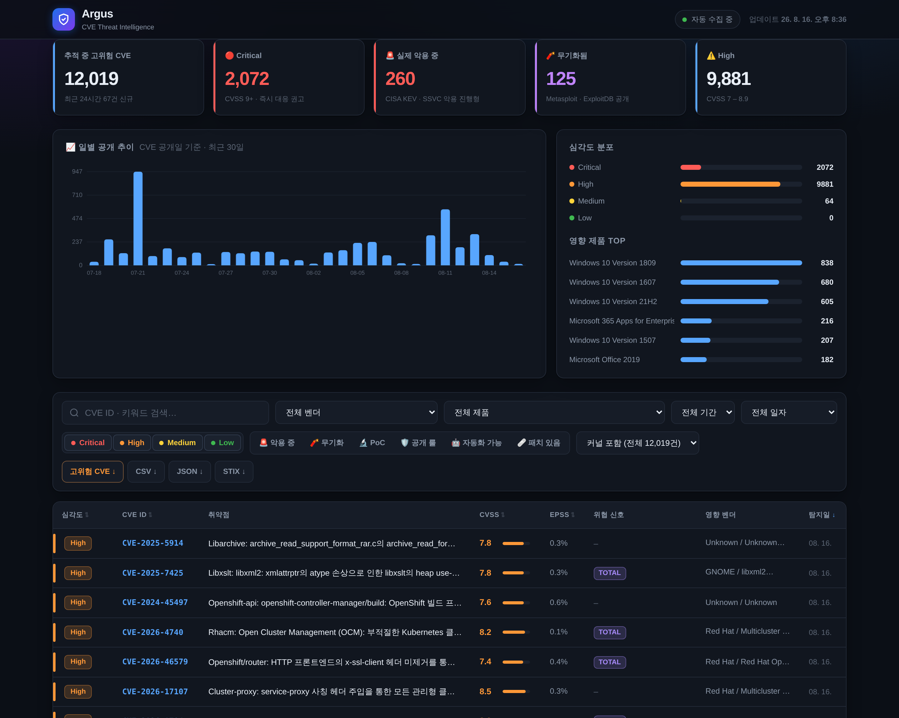
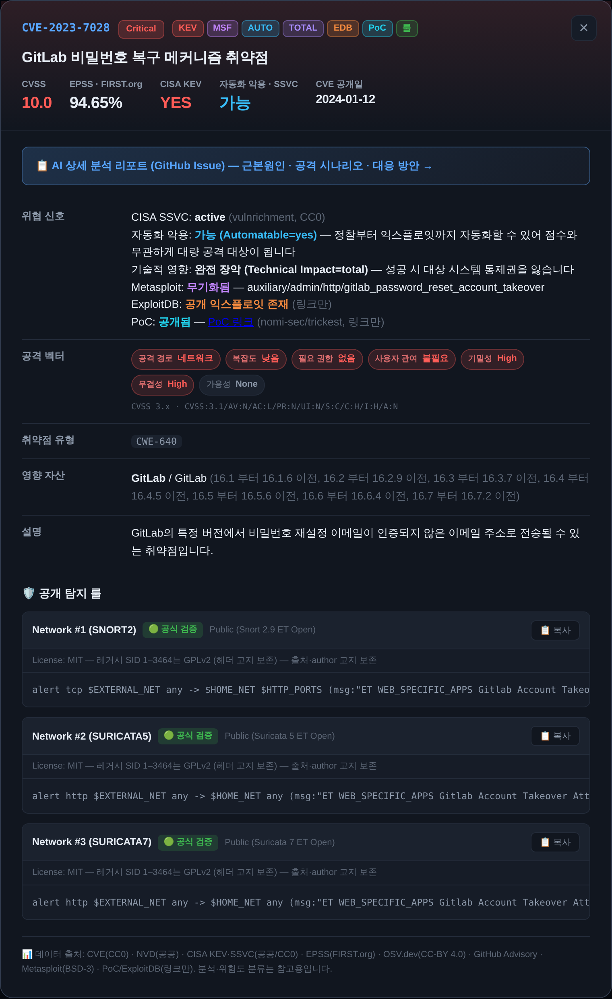
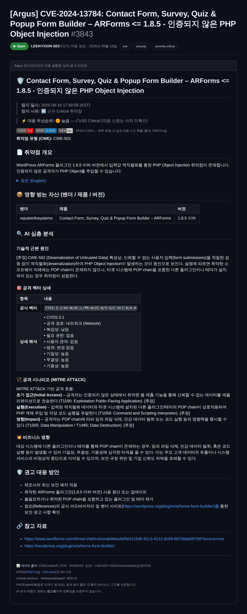
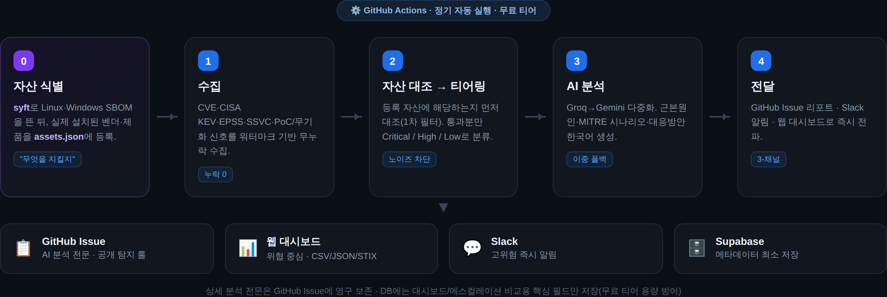

<div align="center">

# Argus

**매일 반복하던 취약점 확인 업무를 자동화한 CVE 위협 인텔리전스 파이프라인**

우리가 쓰지 않는 제품의 CVE는 먼저 제외하고, 남은 소수만 보안 담당자가 판단합니다.

[](https://www.python.org/)
[](.github/workflows/argus.yml)
[](https://leekiyoon-sec.github.io/Argus-AI-Threat-Intelligence/cve.html)
[](LICENSE)
[](#어디서-돌리나)

### 🔗 [**라이브 대시보드 바로가기**](https://leekiyoon-sec.github.io/Argus-AI-Threat-Intelligence/cve.html)

**매시간 자동 실행** · 위협 인텔 10종 교차 검증 · 한국어 리포트 자동 발행 · 조치 근거와 이력 영구 보존

<sub>추적 중인 CVE 수와 발행된 리포트 수는 라이브 대시보드에서 현재 값으로 확인할 수 있습니다.</sub>

</div>



---

## 왜 만들었나

보안 담당자로 일하면서 매일 아침 하는 일이 있습니다. 어제 공개된 CVE 중에 우리 회사가 조치해야 할 게
있는지 확인하는 일입니다.

이걸 하려면 우리가 뭘 쓰고 있는지부터 알아야 합니다. 그래서 `syft`로 Linux·Windows 서버에
무엇이 설치돼 있는지 목록(SBOM)을 먼저 만들었습니다.

그 다음은 매일 똑같습니다. 새로 올라온 CVE를 열어서 영향 받는 벤더·제품이 그 목록에 있는지 봅니다.
없으면 거기서 끝입니다. 있는 것만 실제로 악용되고 있는지(CISA KEV), 악용될 확률이 얼마인지(EPSS),
공격 코드가 이미 공개됐는지(ExploitDB·Metasploit), 악용 상태가 어떤지(CISA SSVC)를 확인합니다.
그리고 패치 방법과 탐지 룰이 공개돼 있는지(SigmaHQ·ET Open·Snort Community·Yara-Rules)를 찾습니다.

어려운 판단은 아닙니다. 문제는 양입니다. 하루에 새로 공개되는 CVE가 수백에서 수천 건인데, 그중 우리 자산에
걸리는 건 손에 꼽습니다. 결국 하루 대부분을 "우리랑 상관없음"을 확인하는 데 씁니다. 영문 원문을 읽고,
벤더마다 다르게 쓰는 제품명을 눈으로 맞춰보고, 사이트를 여기저기 들어갑니다. 바쁘면 건너뛰게 되는데,
건너뛴 날에 KEV 등재된 게 섞여 있으면 그게 사고가 됩니다.

보안 담당자가 할 일은 대조가 아니라, 대조를 통과한 몇 건을 어떻게 처리할지 정하는 쪽입니다.
그래서 매일 하던 순서를 그대로 자동화했습니다. 무엇을 신호로 볼지, 어디서 끊을지, 틀렸을 때
어느 쪽으로 틀리게 할지는 실무에서 판단하고 — 구현은 Claude로 가속했습니다.

```
① 자산 목록 확보   syft로 Linux·Windows SBOM → 실제 설치된 벤더·제품
       │
② 자산 대조        신규 CVE의 영향 벤더·제품이 그 목록에 있는가?   ← 1차 필터, 대부분 여기서 종료
       │
③ 위험도 판단      통과분만 CISA KEV · EPSS · ExploitDB · Metasploit · SSVC로 실제 악용 신호 확인
       │
④ 대응 근거 확보   패치·완화 방안 + 공개 탐지 룰 (SigmaHQ · ET Open · Snort Community · Yara-Rules)
       │
⑤ 전달             급한 건은 Slack 즉시 · 상세 리포트는 GitHub Issue · 나머지는 대시보드에서 추적
```

①은 자산이 바뀔 때만 하면 되고, ②~⑤는 GitHub Actions가 매시간 돌립니다. 이제 수백 건을 직접 훑지
않습니다. 자산에 걸린 몇 건만 확인하면 되고, 바빠서 건너뛰는 날도 없어졌습니다. 남는 시간은 실제로
대응해야 하는 취약점에 씁니다.

---

## 왜 미룰 수 없나

공개된 취약점은 하루만 지나도 N-day, 즉 조치되지 않은 채 남아 있는 취약점이 됩니다.
공격 코드 예시(PoC)가 돌기 시작하면 그다음은 시간 문제입니다.
CISA KEV는 등재 기준 자체가 "조치 방법이 이미 있는 취약점"이어서, 이 목록에 오른 건은 곧
**패치가 나와 있는데도 실제로 악용됐다**는 뜻입니다.

국내에서도 같은 일이 반복됩니다.

| 시점 | 무슨 일이 있었나 | 결과 |
| :--- | :--- | :--- |
| 2017-10 | 오라클이 WebLogic 원격코드실행 취약점(`CVE-2017-10271`) 패치 배포 | 이후 CISA KEV 등재(2022-02) · 랜섬웨어 악용 확인 |
| 2024-11 | 국내 대학 2곳, 같은 패치를 **6년 이상** 적용하지 않은 상태로 침해 | 개인정보보호위원회 과징금 1억 9,300만원 · 4,280만원 |
| 2025-08 | 국내 카드사, 결제 서버 **48대 중 1대**에 같은 패치가 누락된 상태로 침해 | 고객 297만 명 정보 유출(카드번호·CVC 등 민감정보 28만 명) |

<sub>공개 8년이 지난 취약점 하나가 국내에서 계속 반복됐습니다. 출처: 개인정보보호위원회 처분(2024-11-14),
금융당국 합동조사 결과 및 관련 보도(2025), CISA KEV 카탈로그(2026-07-29). 피해 기관은 업종으로만 적었습니다.</sub>

마지막 사고에서 47대는 패치돼 있었고 1대가 빠졌습니다. 무엇이 어디에 설치돼 있는지 목록이 없으면,
이런 누락은 눈으로 찾을 수 없습니다.

---

## 규정은 "즉시 보정"까지만 말합니다

전자금융감독규정 제15조 제1항 제2호는 "시스템프로그램 등의 **긴급하고 중요한 보정(patch)사항에 대하여
즉시 보정작업 실시**"를 요구합니다. ISMS-P `2.10.8 패치관리`와 `2.11.2 취약점 점검 및 조치`, PCI DSS
요구사항 `6.3.1`의 위험 순위 지정도 결국 같은 것을 묻습니다.

그런데 **무엇이 긴급하고 중요한지는 어느 규정도 정해주지 않습니다.** 기준은 각자 세워야 합니다.
"CVSS 7 이상 전부"로 잡으면 하루 수백 건이라 지킬 수가 없고, 지킬 수 없는 기준은 곧 안 지키는 기준이
됩니다. 그때부터는 무엇을 왜 뺐는지 설명할 근거도 남지 않습니다.

Argus가 하는 일이 그 기준을 세우고, 내린 판단을 기록으로 남기는 쪽입니다.

| 규정이 묻는 것 | Argus가 내놓는 답 |
| :--- | :--- |
| 무엇을 쓰고 있나 | `syft`로 뜬 실제 설치 목록(`assets.json`)과 대조합니다 |
| 무엇이 급한가 | KEV 등재, SSVC 악용 상태, EPSS, 무기화 여부를 묶어 3단으로 나눕니다 |
| 어디까지 올려야 하나 | 배포판·릴리스별 **패치 목표 버전**을 리포트와 대시보드에 함께 적습니다 |
| 언제 알았고 무엇을 했나 | 판단 시각과 근거가 GitHub Issue에 남습니다. 지우거나 고치지 않습니다 |
| 어제 안전했던 게 오늘도 안전한가 | 저위험도 30일간 매시간 다시 봅니다. KEV에 오르면 그 자리에서 승격됩니다 |

마지막 줄이 사람 손으로는 가장 안 되는 일입니다. 한 번 "해당 없음"으로 넘긴 CVE를 매일 다시 열어보는
조직은 없습니다. 위 카드사 사례의 취약점도 공개 당시에는 이미 판단이 끝난 건이었습니다.

제로데이는 이 파이프라인의 범위가 아닙니다. 패치도 정보도 없는 시점의 공격은 행위 기반 탐지 장비가
맡을 몫이고, Argus는 공개된 다음부터 조치 전까지를 봅니다.

---

## 핵심 기능

| | 기능 | 설명 |
|:--:|---|---|
| 🎯 | **자산 기준 1차 필터** | SBOM 목록에 걸린 것만 통과. 등록 자산은 저위험까지 추적, 미등록(전체 감시)은 고위험만 수신 |
| 🚨 | **실제 악용 신호 우선** | CISA KEV · EPSS · Metasploit · ExploitDB · CISA SSVC를 종합해 "무기화·악용 진행형"을 최상위 노출 |
| 🧠 | **AI 심층 분석** | 필터를 통과한 건만 근본 원인 · MITRE ATT&CK 공격 시나리오 · 공격 벡터 해석 · 대응 방안을 한국어로 생성 |
| 🔎 | **공개 탐지 룰 매칭** | SigmaHQ · ET Open · Snort Community · Yara-Rules에서 해당 CVE의 검증된 룰을 찾아 리포트에 첨부(출처·라이선스 보존) |
| 📈 | **에스컬레이션 재알림** | 저위험이던 CVE가 KEV 등재·EPSS 급등으로 고위험 전환되면 자동 재알림 |
| 🔁 | **무누락 수집** | 중단된 지점부터 다시 수집(워터마크) + 소프트 데드라인으로 실행이 끊겨도 빈틈 없이 이어받기 |
| 📦 | **패치 목표 버전** | OSV.dev 역인덱스로 "어느 버전까지 올리면 되는지"를 배포판·릴리스별로 리포트와 대시보드에 표시 |
| 🗂️ | **조치 근거 보존** | 발행 시각과 판단에 쓴 신호, 데이터 출처가 GitHub Issue에 그대로 남습니다. 사후 점검·감사에서 요구되는 "언제 알았고 무엇을 근거로 판단했나"가 그대로 기록이 됩니다 |
| 📅 | **주간 요약 리포트** | 직전 주 탐지 결과(신규 · KEV · 무기화 · 영향 제품 TOP)를 GitHub Issue로 자동 발행 |
| 📊 | **웹 대시보드 & Export** | 위협 중심 다크 대시보드 + CSV · JSON · STIX 2.1 내보내기 |

---

## 실제 화면

대시보드에서 실제 악용 여부와 탐지 룰 존재 여부를 한눈에 봅니다. 걸러낸 결과는 CSV·JSON·STIX 2.1로
내보냅니다.

자산 매칭 결과는 대시보드에 싣지 않습니다 — 공개된 정적 사이트라 어떤 CVE가 우리 자산인지 그대로
드러나기 때문입니다. 매칭 판정 자체는 DB에 남아 위험도 티어링과 알림에 계속 쓰이고, 자산 대조 결과를
직접 보려면 터미널 도구(`tools/sbom_match.py`)를 씁니다.

CVSS 벡터는 점수 하나로 뭉쳐 두지 않고 항목별로 쪼개, **위험을 높이는 조건만 빨갛게** 칠했습니다
(아래 화면의 `공격 벡터` 줄 — 네트워크 접근·권한 불필요는 빨강, 높은 공격 복잡도·무결성 영향 없음은 회색).
같은 5.3점이어도 어디가 문제인지가 바로 드러납니다.

Linux 커널 CVE는 전부 `Linux / Linux`로 표기돼 제품 구분이 없고, 목록의 40% 안팎을 차지합니다.
커널 필터가 **포함 · 제외 · 커널만**을 제공하고, 각 선택지에 해당 건수를 함께 적어 무엇을 빼고 보는지
숫자로 확인됩니다.

<div align="center">



<sub>CVE-2025-55182 (React Server Components · CVSS 10.0 · EPSS 99.62% · CISA KEV 등재) —
패치 목표 버전, 위협 신호, 공격 벡터, 영향 버전 범위, 공개 탐지 룰(출처·라이선스 포함)을
한 화면에서 보고 AI 상세 분석 리포트로 이동합니다.</sub>

</div>

---

## 자동 발행되는 상세 리포트

즉시 대응이 필요한 건과 등록 자산에 걸린 건은 GitHub Issue로 상세 리포트가 올라옵니다.
아래는 실제로 발행된 이슈를 그대로 캡처한 것입니다.



<sub>실제 발행 이슈 #3843 — 대응 우선순위 → 위험도 배지 → 한국어 개요 → 영향 자산 →
AI 심층 분석(근본 원인 · 공격 벡터 · MITRE ATT&CK · 비즈니스 영향) → 대응 방안 → 참고 자료 순입니다.</sub>

이슈는 읽는 리포트입니다. 판단에 필요한 근거만 담고, 대응 관리는 이미 쓰던 도구에서 합니다.
**근거가 없는 항목은 아예 싣지 않습니다.** 위 이슈에 `위협 신호`와 `공개 탐지 룰` 절이 없는 것이
그래서입니다 — CVSS 9.8이지만 KEV·Metasploit·PoC 어느 것도 아직 없고, 공개 룰셋에도 이 CVE가
없습니다. OSV가 패치 버전을 모르면 그 표도 같은 식으로 빠집니다. 추적 CVE의 98.9%가 공개 룰이
없어서, "없습니다"를 설명하기 시작하면 본문 대부분이 그 얘기가 됩니다.
발행 시각과 내용이 그대로 남으므로 사후 점검·감사 때 참조할 자료로도 쓰입니다.

---

## 동작 방식



<sub>수집(cvelistV5 커밋 감시) → 자산 대조 → 위협 인텔 보강 → 티어링 → 번역·분석 → 발행(Issue·Slack·대시보드).
진행 지점은 Supabase에 기록해 실행이 끊겨도 다음 회차가 그 지점부터 이어받습니다.</sub>

자산을 등록하면 하루치가 이렇게 줄어듭니다.

**2026년 7월 21일 · 오라클 분기 보안 패치 공개일 · 건수는 NVD 공개 기준**

```
그날 공개된 CVE        1,474건
      │  ① 자산 대조 — Oracle WebLogic을 자산으로 등록했다면
      ▼
자산에 영향                25건   ← 나머지 1,449건은 여기서 종료
      │  ② 심각도 · 악용 신호
      ▼
Critical · 즉시 대응       13건   → Issue 리포트 발행 (High 12건은 대시보드 추적)
```

그날 Critical로 분류된 13건입니다.

`CVE-2026-60365`(10.0) · `CVE-2026-60206`(9.9) · `CVE-2026-60364` · `CVE-2026-60294` · `CVE-2026-60292` ·
`CVE-2026-60291` · `CVE-2026-60205` · `CVE-2026-60204` · `CVE-2026-60202` · `CVE-2026-60200` ·
`CVE-2026-60199` · `CVE-2026-60198`(이상 9.8) · `CVE-2026-60208`(9.1)

<sub>NVD가 그날 공개한 WebLogic 취약점 25건을 Argus도 25건 모두 수집했습니다. 라이브 대시보드에서 제품
`Oracle WebLogic Server`로 필터하면 같은 목록이 나옵니다. 자산 목록을 공개 저장소에 올릴 수 없어 실제
인스턴스는 전체 감시(`*/*`)로 돌리고 있고, 위 25건은 WebLogic을 자산으로 등록했을 때 걸리는 건수입니다.</sub>

---

## 위험도는 어떻게 나누나

CVSS 7점대가 하루 수백 건이라 점수만으로는 순서가 정해지지 않습니다.
무엇을 먼저 볼지는 **실제로 공격에 쓰이고 있는지**를 보고 정합니다.

| 단계 | 조건 | 왜 이 등급인가 | 처리 |
| :--- | :--- | :--- | :--- |
| **Critical** | KEV 등재 · Metasploit 무기화 · SSVC 악용 진행형 · EPSS 급증 · CVSS 9+ | 이 신호들은 "공격당할 수 있다"가 아니라 **"이미 공격에 쓰이고 있다"**는 관측 결과입니다. 정기 패치 주기를 기다리면 그 기간이 그대로 노출 구간이 되므로, 긴급 패치로 당겨야 합니다 | GitHub Issue 리포트 + Slack 즉시 알림 |
| **High** | CVSS 7~8.9 · 악용 신호는 아직 없음 | 점수는 높지만 하루 수백 건이라 전부 즉시 대응할 수는 없습니다. 다만 **신호가 하나만 붙어도 Critical**이 됩니다. 안전해서 미루는 게 아니라 순서를 두는 것입니다 | 대시보드 추적 · 매 실행마다 신호 재확인 후 자동 승격 |
| **Low** | 그 외 | 낮다고 버리지 않습니다. 전부 알리면 노이즈에 묻혀 정작 급한 건을 놓치므로, **알림은 안 하고 관측은 계속하는** 구간입니다 | 등록 자산이면 추적 · 아니면 최소 기록 |

등록한 자산에 걸리면 High도 Critical과 똑같이 리포트를 발행합니다. 실제로 대응해야 하는 건이기 때문입니다.

**저위험도 계속 봅니다.** 추적 중인 저위험 CVE는 30일간 매시간 재평가하고, KEV 등재나 EPSS 급등이 잡히면
그 자리에서 Critical로 올려 리포트를 발행합니다. 미등록 자산이라 저장하지 않은 CVE라도 새로 KEV에 오르면
별도 경로로 다시 수집합니다.

판정에 쓰는 신호는 넷입니다.

| 신호 | 무엇인가 |
| :--- | :--- |
| **CISA KEV** | 실제 악용 증거가 확인된 취약점만 등재하는 미국 정부 목록. 등재는 공격이 관측됐다는 뜻입니다 |
| **EPSS** (FIRST.org) | 향후 30일 내 악용 시도 확률. 급등은 공격 준비 신호입니다 |
| **Metasploit** | 공개 침투 도구에 모듈이 올라온 상태. 전문 지식 없이도 공격이 가능해집니다 |
| **CISA SSVC** | 악용 상태를 none / poc / active로 구분한 공식 판단. active는 진행 중이라는 뜻입니다 |

---

## 자산 목록은 SBOM으로 만들었습니다

자산을 추측으로 적으면 대조가 의미 없어서, 서버에서 `syft`로 실제 설치된 목록을 뽑았습니다.

```bash
# Linux
sudo syft / -o cyclonedx-json=sbom-linux.json
```

```powershell
# Windows
syft C:\ -o cyclonedx-json=sbom-windows.json
```

여기서 나온 벤더와 제품명을 `assets.json`에 등록해 쓰고 있습니다.
SBOM과 CVE 레코드의 표기가 서로 달라서
(`Microsoft Corporation` / `microsoft`, `Exchange Server` / `exchange_server`) 대소문자와 `_`·공백 차이는
코드에서 흡수하고, 벤더를 특정하기 어려우면 `*`로 제품만 지정합니다.

CVE 레코드가 벤더를 아예 안 주는 경우도 있습니다. MITRE가 할당한 레코드는 `vendor: "n/a"`로
비워두는 일이 잦은데, 그때도 NVD의 CPE에는 값이 들어 있곤 합니다.

```
CVE-2020-29574   CNA 원본 : vendor="n/a"          ← 레코드에는 없음
                 NVD CPE  : sophos / cyberoamos   ← 여기엔 있음
```

그래서 유효한 벤더가 하나도 없으면 NVD CPE를 조회해 채웁니다. 자산 매칭뿐 아니라
대시보드의 벤더 필터에도 쓰이므로, 추적이 확정된 건은 표시용으로도 한 번 더 채웁니다.
NVD에도 CPE가 없으면 방법이 없습니다 — 표본상 절반 정도가 그렇고, 대부분 NVD가 아직
분석을 끝내지 않은 최신 CVE입니다. 주간 잡이 반복해서 훑으며 채워집니다.

### 터미널에서 대조하기 (`tools/sbom_match.py`)

자산 목록 전체를 CVE와 맞춰보는 일은 터미널에서 합니다. 브라우저에서 하려면 SBOM 파일을
올려야 하는데, 파일 선택이 막힌 업무 환경에서는 쓸 수 없고 자산 목록을 브라우저에 넣는 것
자체가 부담이기 때문입니다. **표준 라이브러리만 쓰므로 `pip install`이 필요 없고**, 자산
목록은 어디로도 전송되지 않습니다 — 공개된 인덱스 파일을 내려받아 로컬에서 대조할 뿐입니다.
(대시보드는 CVE별 패키지 이름과 패치 버전을 보여주는 데까지만 합니다.)

```bash
# SBOM을 CSV로 (name 열만 있으면 동작하고, 나머지는 있으면 정확도가 올라갑니다)
syft dir:. -o syft-json | jq -r '["name","source","version","type","purl"],
    (.artifacts[] | [.name, (.metadata.source // ""), .version, .type, .purl]) | @csv' > sbom.csv

python3 tools/sbom_match.py sbom.csv                  # 공개 인덱스를 받아 대조
python3 tools/sbom_match.py sbom.csv --csv > out.csv  # CSV·JSON 출력
python3 tools/sbom_match.py sbom.csv --offline ./data # 망분리: 미리 받아둔 파일 사용
```

```
추적 CVE 12,019건 · 패키지 인덱스 6,333건 · 커널 별칭 168종
CVE             심각도  KEV  패키지    설치                → 목표              판정
CVE-2026-45447  High        openssl  3.0.11-1~deb12u2  3.0.20-1~deb12u2  취약 추정
CVE-2025-15467  High        openssl  3.0.11-1~deb12u2  3.0.18-1~deb12u2  취약 추정
CVE-2026-4800   High        lodash   4.17.20           4.17.21           취약 추정
CVE-2026-54876  High        openssl  3.0.11-1~deb12u2                    버전 미확인

[묶음] linux-image-6.1.0-13-amd64 6.1.55-1 → 6.1.180-1 — 관련 CVE 3,884건(취약 추정 3,780 · KEV 4건)
```

커널처럼 CVE가 수천 건 쏟아지는 패키지는 한 줄로 접습니다. 커널은 CVE마다 고치는 게 아니라
패키지를 한 번 올리는 단위인데, 전부 늘어놓으면 정작 손댈 나머지가 묻히기 때문입니다
(실측: 4,301건 중 4,297건이 커널이라 나머지 4건이 안 보였습니다). 목표 버전은 설치된 것과
같은 시리즈에서 고릅니다 — 전체 최댓값을 쓰면 6.1 계열 사용자에게 7.1로 올리라는 답이 나갑니다.

**판정은 틀리더라도 안전한 쪽으로 틀리게 했습니다.** `수정판 추정`은 설치된 배포판·릴리스의
수정 버전이 인덱스에 있고 그것을 넘어섰을 때만 나옵니다. 내 릴리스 항목이 없으면 다른
릴리스나 다른 배포판의 숫자로 답하지 않고 `버전 미확인`으로 둡니다 — Debian의 `6.8.9-1`과
Ubuntu의 `6.8.0-1021.23`은 체계가 달라 대소 비교에 의미가 없고, 그렇게 답하면 취약한 호스트를
안전하다고 보고하게 됩니다. 반대로 `취약 추정`은 릴리스가 달라도 알립니다 — 이쪽 오답은
확인 한 번으로 끝나지만, 반대는 놓침이 됩니다.

<details>
<summary><b>커널 패키지를 어떻게 다루나</b></summary>

Ubuntu는 커널을 배포 대상별로 따로 빌드해 소스 패키지를 쪼갭니다 — `linux-aws`,
`linux-azure-5.13`, `linux-oem-6.8`, `linux-riscv-5.11` … 한 CVE에 118개까지 붙습니다.
그대로 실으면 인덱스 용량의 99%를 이 변종들이 차지하고, 리포트의 패치 버전 표도
`Ubuntu Pro 14.04` 같은 남의 환경으로 채워집니다.

그래서 기본 `linux`가 있는 CVE에서는 변종을 접어 인덱스를 **1.1MB**로 유지하고,
접힌 이름 168종은 별칭 목록으로 함께 실어(약 3KB) 대조할 때 `linux`로 되돌려 찾습니다.
`linux-aws`를 쓰는 호스트도 그대로 잡힙니다.

접는 대상은 `linux-*`로 한정합니다. 이름이 비슷하다고 넓게 접으면 `firefox-esr` ·
`xz-utils` · `grub2-signed`처럼 실제로 다른 소스 패키지까지 사라지는데, 이름 대조가
바로 그 이름으로 이뤄지므로 조용한 누락이 됩니다. 기본 `linux`가 없거나 그쪽에 수정
버전이 없는 CVE는 변종이 유일한 답이므로 접지 않습니다.

</details>

---

## AI 스택

분석 품질은 평균보다 **편차**가 중요합니다 — 어제와 오늘의 리포트가 다른 모델에서 나오면
기준이 흔들리기 때문입니다. 그래서 **역할마다 모델을 2단으로** 두고, 앞 모델이 한도에 걸리거나
서버 오류를 내면 같은 역할의 다음 모델이 이어받습니다. 한도는 모델별로 따로 잡히므로 앞이
소진돼도 뒤는 그대로 남아 있습니다.

| 용도 | 모델 | 비고 |
|---|---|---|
| **심층 분석** | `gemini-3.5-flash-lite` → `gemini-3.1-flash-lite` | JSON 모드로 구조화 출력 보장. 분석 대상이 Critical뿐이라 하루 6~30건 — RPD 500에 여유가 큽니다 |
| **한국어 번역** | `gemma-4-31b-it` → `gemma-4-26b-a4b-it` | CVE 제목·설명 요약. 분석과 다른 모델이라 예산을 나눠 쓰지 않습니다 |

두 단계가 모두 불가하면 **정형 폴백**으로 내려갑니다 — 분석은 안내문, 번역은 영문 원문으로
리포트가 나가고, 번역은 다음 실행의 백필이 회수합니다. 공급자가 통째로 멈춰도 파이프라인은
계속 돌고 유실이 아니라 지연으로 흡수됩니다.

> AI API 키(Google AI Studio)는 **이용자가 직접 발급**해 GitHub Secrets에 등록합니다.
> 무료 티어 한도 내 사용을 전제로 설계했으며, 각 AI 서비스의 이용약관은 이용자 책임하에 준수해야 합니다.

---

## 판정이 맞는지 어떻게 확인하나

이 도구의 출력은 "지금 뭘 먼저 패치할지"를 정하는 근거라, 판정이 틀리면 놓치거나 헛것을
쫓게 됩니다. 그래서 규칙을 손댈 때마다 **배포 중인 실데이터로** 확인합니다.

| 무엇을 | 어떻게 |
| :--- | :--- |
| **SBOM 대조 누락** | 커널 변종을 접기 전/후 인덱스를 통째로 대조 — (CVE, 패키지명) 조합 중 접기 전에 잡히던 게 안 잡히는 게 하나라도 있으면 실패 |
| **판정 경계** | CVSS·EPSS 임계값, 알림 전이 조건, 저장된 값이 `null`인 경우. 티어 판정과 Slack 즉시 알림이 같은 기준인지 신호 조합 전수 대조 |
| **무누락 수집** | 워터마크 전진·격리 해제·이월 계산을 시나리오별로. 실패한 건이 워터마크를 넘어가지 않는지 |
| **화면** | 배포 중인 실데이터 전량을 브라우저에 띄워 렌더·필터·모달·내보내기와 콘솔 오류 |

오답의 방향도 규칙으로 정해 뒀습니다. 취약한 것을 안전하다고 말하는 쪽이 반대보다 훨씬
나쁘므로, 확신이 없으면 `버전 미확인`으로 남기고 `수정판`이라고 단정하지 않습니다.

---

## 어디서 돌리나

GitHub Actions·Pages·Supabase·Google AI Studio 위에서 돌아갑니다. 별도 서버 없이 무료 티어 안에서
운영되게 만들었습니다. 사내 서버나 유료 플랜에 올리면 처리량 상한만 올라가고 로직은 그대로입니다.

---

## 데이터 출처 & 라이선스

Argus가 사용하는 모든 외부 데이터와 그 라이선스입니다. **재게시 시 원 출처·author·라이선스 고지를 보존**하며,
저작권이 제출자에게 있는 PoC·익스플로잇 원문(ExploitDB·nomi-sec 등)은 **재게시하지 않고 링크만** 표시합니다.

| 데이터 | 용도 | 라이선스 / 취급 방침 |
|---|---|---|
| **CVE Program** (cvelistV5) | CVE 원본 레코드 | CC0 1.0 (퍼블릭 도메인) |
| **CISA KEV** | 실제 악용 확인 목록 | U.S. Government Work (퍼블릭 도메인) |
| **CISA vulnrichment** (SSVC) | 악용 상태·CVSS·CWE 보강 | CC0 1.0 |
| **NVD** (NIST) | CVSS·CWE·CPE 보충 | U.S. Government Work (퍼블릭 도메인) |
| **EPSS** (FIRST.org) | 악용 확률 점수 | 무료 공개 · **출처 표기**(대시보드/리포트에 FIRST.org 명시) |
| **OSV.dev** | CVE ↔ 패키지 이름 대응 (SBOM 대조용) | **CC-BY 4.0** (출처 표기 — 대시보드 데이터 파일에 명시) |
| **GitHub Advisory** | 영향 패키지 정보 | GitHub ToS |
| **PoC** (nomi-sec / trickest) | PoC 공개 신호 | 개별 PoC 저작권=제출자 → **원문 미게시, 링크만** |
| **ExploitDB** | 공개 익스플로잇 신호 | 개별 PoC 저작권=제출자 → **원문 미게시, 링크만** |
| **Metasploit** metadata | 무기화 신호 | BSD-3-Clause (출처: Rapid7 표기) |
| **SigmaHQ** | 공개 탐지 룰 | DRL 1.1 (author 표기 보존) |
| **ET Open** (Emerging Threats) | 공개 네트워크 룰 | MIT (레거시 SID 1–3464는 GPLv2) |
| **Snort Community** | 공개 네트워크 룰 | GPLv2 |
| **Yara-Rules** | 공개 YARA 룰 | GPL-2.0 |

> 📌 **기업/영리 목적 활용 시 유의**
> 이 저장소의 **코드**는 아래 MIT 라이선스로 자유롭게 사용할 수 있으나, 위 **외부 데이터·룰**은 각자의
> 라이선스(GPL·DRL·CC0 등)를 따릅니다. 룰을 자사 제품·서비스에 재배포·통합할 경우 해당 라이선스(특히
> GPL 계열의 copyleft, DRL의 author 표기 의무)를 별도로 확인·준수해야 합니다.

---

## 직접 써보기

<details>
<summary><b>설정 펼치기</b></summary>

### 1. 감시할 자산 등록 (`assets.json`)

가장 먼저 할 일은 무엇을 지킬지 정하는 것입니다. 위 [SBOM 단계](#자산-목록은-sbom으로-만들었습니다)로 파악한
벤더/제품을 `active_rules`에 추가합니다.

```json
{
  "active_rules": [
    { "vendor": "microsoft", "product": "exchange_server" },
    { "vendor": "*",         "product": "nginx" },
    { "vendor": "fortinet",  "product": "*" }
  ]
}
```

| 표기 | 의미 | 쓰는 상황 |
|---|---|---|
| `vendor` / `product` | 특정 벤더의 특정 제품 | 정확히 아는 자산 |
| `*` / `product` | **제품만** 감시 (벤더 무관) | 벤더 표기를 모르거나 여러 벤더가 배포하는 제품 |
| `vendor` / `*` | **특정 벤더**의 모든 제품 | 그 벤더 제품을 폭넓게 쓰는 경우 |
| `*` / `*` | 전체 감시 | 자산 확정 전 — 고위험만 수신 |

> 벤더/제품명은 대소문자와 `_`·공백 표기 차이를 흡수해 매칭합니다 (`Exchange Server` ↔ `exchange_server`).
> CVE 레코드에 벤더 정보가 없으면 NVD CPE와 설명 텍스트로 보완합니다.

### 2. GitHub Secrets 등록

| Secret | 발급처 | 필수 |
|---|---|:--:|
| `GEMINI_API_KEY` | [aistudio.google.com](https://aistudio.google.com) | ✅ |
| `SUPABASE_URL` · `SUPABASE_KEY` | [supabase.com](https://supabase.com) | ✅ |
| `SLACK_WEBHOOK_URL` | Slack Incoming Webhook | ✅ |
| `GH_TOKEN` | GitHub PAT (issues:write) | ✅ |
| `NVD_API_KEY` | [nvd.nist.gov](https://nvd.nist.gov/developers/request-an-api-key) | 선택 (없으면 조회 속도 제한) |
| `VULNCHECK_API_KEY` | [vulncheck.com](https://vulncheck.com) | 선택 (없으면 건너뜀) |

### 3. DB 테이블

`cves` 외에 파이프라인 진행 상태를 담는 1행짜리 테이블이 필요합니다. Supabase SQL Editor에서:

```sql
create table if not exists pipeline_state (
  id         int primary key,
  state      jsonb       not null default '{}'::jsonb,
  updated_at timestamptz not null default now()
);
insert into pipeline_state (id, state) values (1, '{}'::jsonb)
  on conflict (id) do nothing;
```

워터마크(마지막 처리 시각)·실패 추적·일일 AI 요청 수·소급 작업 진행 위치가 여기 들어갑니다.
상태를 DB에 두므로 저장소에는 아무것도 커밋하지 않습니다 — 매시간 도는 파이프라인이
저장소를 불리지 않는 이유입니다.

### 4. 실행

- **Actions** 탭에서 워크플로를 활성화하면 정기 실행됩니다. (`.github/workflows/argus.yml`)
- **Settings → Pages → Source** 를 **`GitHub Actions`** 로 설정합니다.
  대시보드는 브랜치가 아니라 워크플로가 만든 아티팩트로 배포됩니다 — 데이터 파일을
  커밋하지 않으므로 저장소가 더 커지지 않습니다.
- 처음 한 번은 **Argus Maintenance → `package-index`** 를 수동 실행해 CVE↔패키지
  역인덱스를 만듭니다(주 1회 자동 갱신). 이게 있어야 패치 목표 버전과 SBOM 대조가 동작합니다.

### 5. 소급 작업 (선택)

이미 쌓인 데이터를 뒤늦게 채우는 수동 잡입니다. 전부 `Argus Maintenance`에서 실행합니다.

| 작업 | 언제 쓰나 |
| :--- | :--- |
| `backfill-published` | 추이 차트를 공개일 기준으로 쓰려는데 과거 행에 공개일이 없을 때. `backfill_days`를 늘리면 더 과거까지 (2024년 이전은 7000) |
| `backfill-vendors` | 벤더가 `n/a`로 남은 행을 NVD CPE로 복구. 주간 스케줄에도 얹혀 있어 NVD가 분석을 끝내는 만큼 계속 채워집니다 |

소급 잡은 '확인일'을 보존하려고 `updated_at`을 건드리지 않으므로, 끝나면 다음 export를
전량으로 돌리도록 표시를 남깁니다. 급하면 **Argus CVE Monitor**를 수동 실행하면서
`full_export`를 체크하면 그 자리에서 전량으로 다시 그립니다.

</details>

---

> ⚠️ 이 도구가 생성·표시하는 AI 분석 결과와 위험도 분류는 **참고용**입니다.
> 실제 대응·패치 결정은 각 조직의 환경과 공식 벤더 권고를 함께 검토해 판단하시기 바랍니다.

---

## License

Code is licensed under the **[MIT License](LICENSE)** © 2026 LEEKIYOON-SEC.
외부 데이터 및 탐지 룰은 위 [데이터 출처 & 라이선스](#데이터-출처--라이선스) 표의 각 라이선스를 따릅니다.

---

<div align="center">

**🔗 [라이브 대시보드](https://leekiyoon-sec.github.io/Argus-AI-Threat-Intelligence/cve.html)**

`https://leekiyoon-sec.github.io/Argus-AI-Threat-Intelligence/cve.html`

</div>
